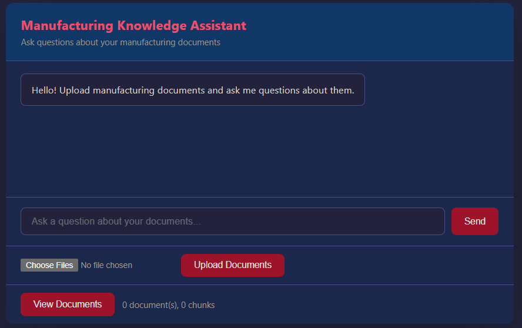

# Manufacturing Knowledge Assistant

AI-powered knowledge base for manufacturing documents. Upload documents (PDF, Word, Excel, TXT), ask questions, and get cited answers powered by RAG (Retrieval-Augmented Generation).

## Screenshot



## Architecture

```
Documents → Ingestion Pipeline → ChromaDB (vectors)
                                        ↓
User Question → Retrieve Similar Chunks → Claude → Cited Answer
```

## Tech Stack

- **Backend**: FastAPI + Uvicorn
- **Vector DB**: ChromaDB (persistent, embedded)
- **Embeddings**: sentence-transformers (all-MiniLM-L6-v2)
- **LLM**: Claude (Anthropic API)
- **MCP**: Model Context Protocol server for Claude Desktop integration
- **Frontend**: Vanilla HTML/CSS/JS with streaming responses

## Setup

```bash
# Clone and install
git clone https://github.com/Sallyyyyhuang/manufacturing-assistant.git
cd manufacturing-assistant
python -m venv .venv
source .venv/Scripts/activate  # Windows Git Bash
pip install -e ".[dev]"

# Configure
cp .env.example .env
# Edit .env and add your ANTHROPIC_API_KEY

# Load sample documents
python scripts/seed_samples.py

# Run the server
uvicorn src.api.app:app --reload --port 8000
```

Visit http://localhost:8000 to use the chat interface.

## API Endpoints

| Method | Endpoint | Description |
|--------|----------|-------------|
| POST | /api/ask | Ask a question (streaming SSE response) |
| POST | /api/ingest | Upload and ingest documents |
| GET | /api/documents | List ingested documents |
| DELETE | /api/documents | Clear all documents |

## MCP Integration

Add to Claude Desktop config (`%APPDATA%/Claude/claude_desktop_config.json`):

```json
{
  "mcpServers": {
    "manufacturing-assistant": {
      "command": "path/to/.venv/Scripts/python.exe",
      "args": ["path/to/scripts/run_mcp.py"]
    }
  }
}
```

## Project Structure

```
src/
├── config.py              # Environment-based configuration
├── ingestion/             # Document loading and chunking
├── vectorstore/           # ChromaDB wrapper
├── rag/                   # Retrieval + Claude generation
├── mcp_server/            # MCP tool server
└── api/                   # FastAPI + static frontend
```

## Skills Demonstrated

- **Python**: Clean OOP, type hints, async, generators
- **AI/ML**: RAG pipeline, embeddings, vector similarity search
- **Data Engineering**: Document parsing, chunking strategies, ETL pipeline
- **API Design**: RESTful endpoints, streaming, file uploads
- **System Design**: Modular architecture, multiple interfaces (HTTP, MCP, CLI)
